<!-- TODO: update for current version -->
# GFE Database

The GFE database (`gfe-db`) represents the relationships between GFEs, features, sequences and other types of data. The new schema is centered around the GFE node and makes the curation and database versioning of WHO designations or WHO labels an optional annotation of GFEs.

<br>
<p align="center">
  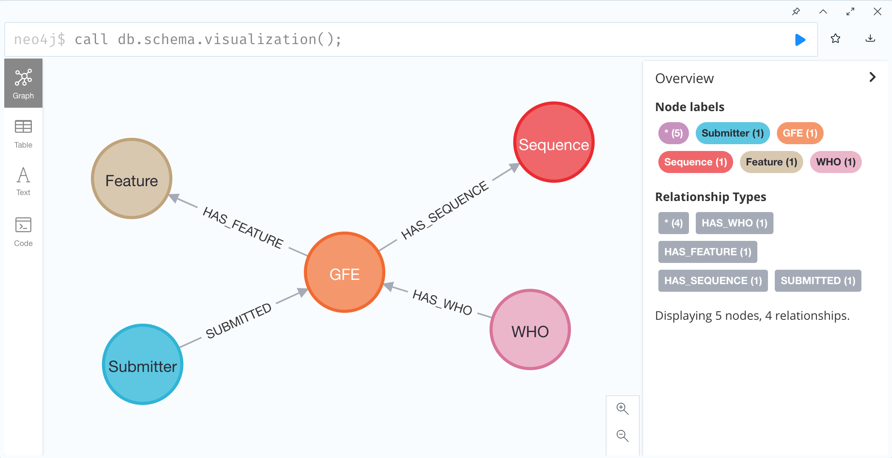
</p>

## Nodes 
### `GFE` nodes

<p align="center">
  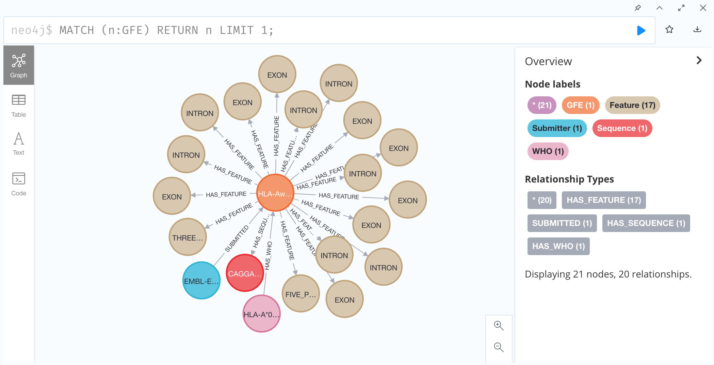
</p>

#### Description
Each node represents a distinct GFE object.  For example, a GFE with gfe_name="HLA-Aw2-1-1-1-1-4-1-1-1-2-1-1-1-1-1-1-4" corresponds to a  full sequence and also 17 features:
- FIVE_PRIME_UTR
- EXON (1-8)
- INTRON (1-7)
- THREE_PRIME_UTR
<!-- TODO: add link to documentation of GFE names -->

#### Properties
```json
{
  "gfe_name": "HLA-Aw99-8-363-912-781-2901-128-581-151-324-198-9-316-80-508-43-30",
  "locus": "HLA-A"
}
```
| Property   | Example                                                            | Data Type | Description                            |
|------------|--------------------------------------------------------------------|-----------|----------------------------------------|
| `gfe_name` | HLA-Aw99-8-363-912-781-2901-128-581-151-324-198-9-316-80-508-43-30 | string    | Gene Feature Enumeration name          |
| `locus`    | HLA-A                                                              | string    | Position of the gene on the chromosome |
### `Feature` nodes
<p align="center">
  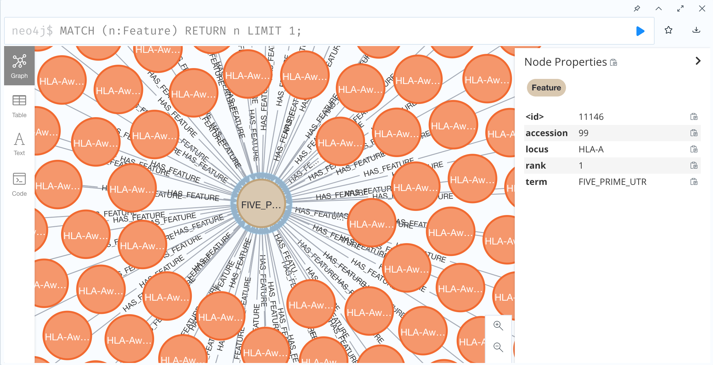
</p>

#### Description
<!-- A feature is a tuple of: locus, term, rank and sequence. -->
A feature is a tuple of: locus, term and rank. A locus is "anything in [HUGO](https://www.genenames.org/)", and a term is "anything in [sequence ontology](http://www.sequenceontology.org/)".

#### Properties
```json
{
  "accession": 99,
  "locus": "HLA-A",
  "rank": 1,
  "term": "FIVE_PRIME_UTR"
}
```
| Property    | Example        | Data Type | Description                                                                                |
|-------------|----------------|-----------|--------------------------------------------------------------------------------------------|
| `accession` | 2901           | string    | Relatively stable unique record identifier for a sequence                                  |
| `locus`     | HLA-A          | string    | Position of the gene on the chromosome                                                     |
| `rank`      | 7              | string    | Ordinal number describing the position of the Feature sequence on the allele               |
| `term`      | FIVE_PRIME_UTR | string    | Label describing the type of Feature; One of FIVE_PRIME_UTR, EXON, INTRON, THREE_PRIME_UTR |

### `Sequence` nodes
<p align="center">
  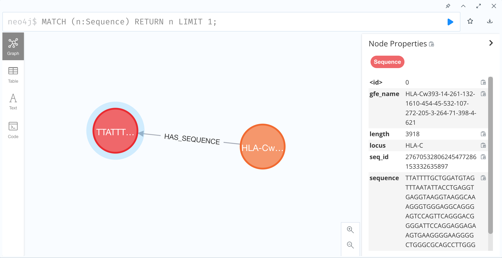
</p>

#### Description
The nucleotide sequence corresponding to the GFE.

#### Properties
```json
{
  "gfe_name": "HLA-Cw393-14-261-132-1610-454-45-532-107-272-205-3-264-71-398-4-621",
  "length": 3918,
  "locus": "HLA-C",
  "seq_id": 27670532806245477286153332635897,
  "sequence": "TTATTTTGCTGGATGTAGTTTAATATTACCTGAGGTGAGGTAAGGTA..."
}
```
| Property   | Example                                                             | Data Type | Description                                                             |
|------------|---------------------------------------------------------------------|-----------|-------------------------------------------------------------------------|
| `gfe_name` | HLA-Cw393-14-261-132-1610-454-45-532-107-272-205-3-264-71-398-4-621 | string    | Gene Feature Enumeration name                                           |
| `length`   | 3918                                                                | integer   | Length of nucleotide sequence                                           |
| `locus`    | HLA-C                                                               | string    | Position of the gene on the chromosome                                  |
| `seq_id`   | 27670532806245477286153332635897                                    | integer   | Compressed UUID based on MD5 hash of sequence (used for faster indexing) |
| `sequence` | TTATTTTGCTGGATGTAGTTTAATATTACCTGAGGTGAGGTAAGGTA...                  | string    | Full nucleotide sequence                                                     |

### `WHO` nodes
<p align="center">
  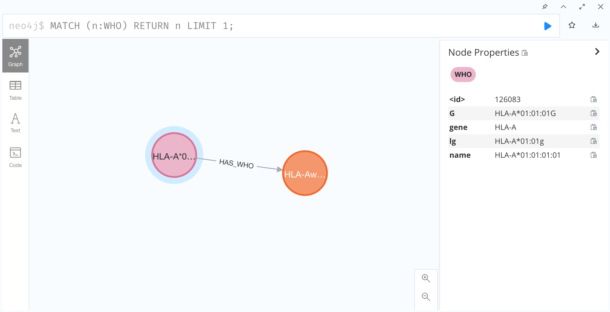
</p>

#### Description
World Health Organization designations for HLA alleles [wikipedia](https://en.wikipedia.org/wiki/History_and_naming_of_human_leukocyte_antigens).

#### Properties
```json
{
  "G": "HLA-A*01:01:01G",
  "gene": "HLA-A",
  "lg": "HLA-A*01:01g",
  "name": "HLA-A*01:01:01:01"
}
```
| Property | Example           | Data Type | Description                                                        |
|----------|-------------------|-----------|--------------------------------------------------------------------|
| `name`   | HLA-A*01:01:01:01 | string    | WHO naming convention for HLA alleles                              |
| `gene`   | HLA-A             | integer   | The gene or gene locus referenced by the node                      |
| `lg`     | HLA-A*01:01g      | string    | "lg" group derived from Antigen Recognition Domain (ARD) reduction |
| `G`      | HLA-A*01:01:01G   | string    | "G" group derived from Antigen Recognition Domain (ARD) reduction  |

### `Submitter` nodes
<p align="center">
  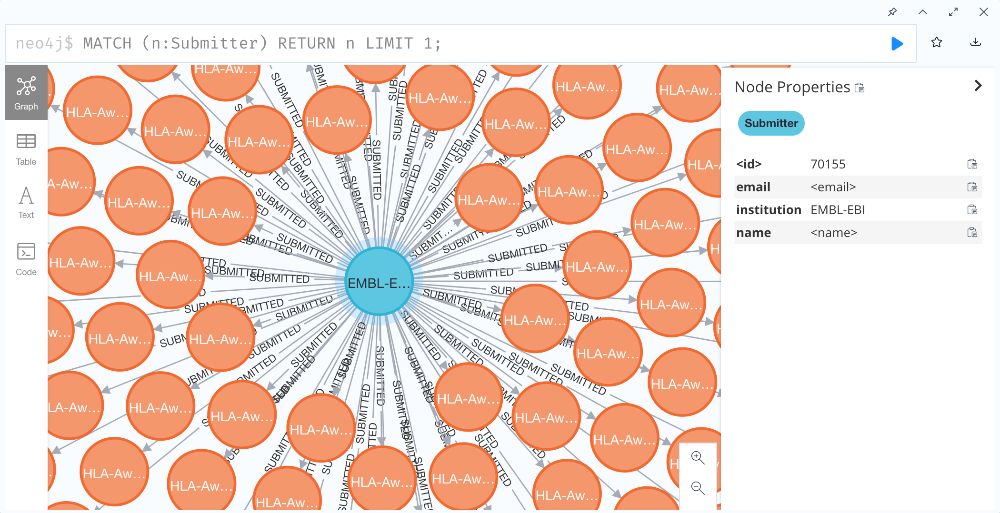
</p>

#### Description
Describes the submitter of a GFE node.

#### Properties
```json
{
  "email": "<email>",
  "institution": "<institution name>",
  "name": "<name>"
}
```
| Property      | Example                  | Data Type | Description             |
|---------------|--------------------------|-----------|-------------------------|
| `email`       | <name>@cibmtr.org        | string    | Submitter's email       |
| `institution` | CIBMTR                   | integer   | Submitter's institution |
| `name`        | first name last name | string    | Submitter's full name   |

## Edges

### `HAS_FEATURE` edge
<p align="center">
  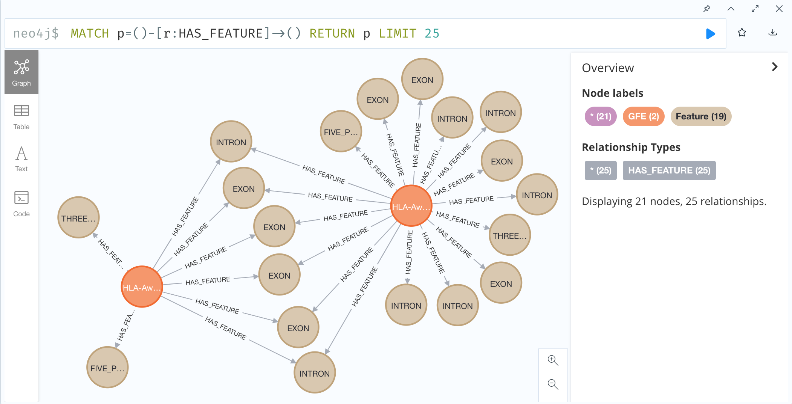
</p>

#### Description
Links a GFE node to a Feature node.

#### Properties
```json
{
  // No properties
}
```

### `HAS_SEQUENCE` edge
<p align="center">
  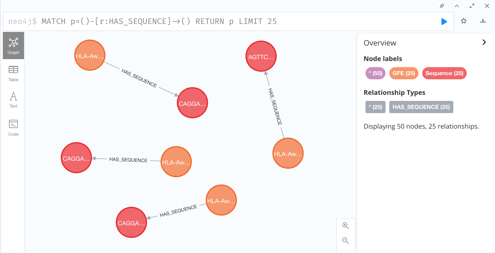
</p>

#### Description
Links a GFE node to the full Sequence node.

#### Properties
```json
{
  // No properties
}
```

### `HAS_WHO` edge
<p align="center">
  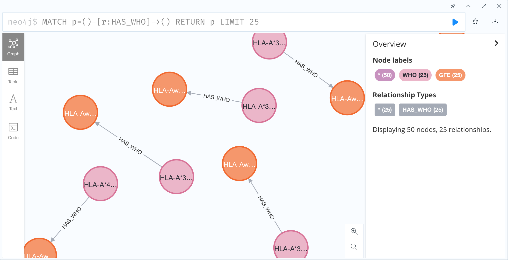
</p>

#### Description
Links a GFE node to the WHO designation node. 

#### Properties
```json
{
  "releases": [3470, 3460]
}
```
| Property   | Example      | Data Type      | Description                                  |
|------------|--------------|----------------|----------------------------------------------|
| `releases` | [3470, 3460] | array[integer] | Release versions containing the relationship |

### `SUBMITTED` edge
<p align="center">
  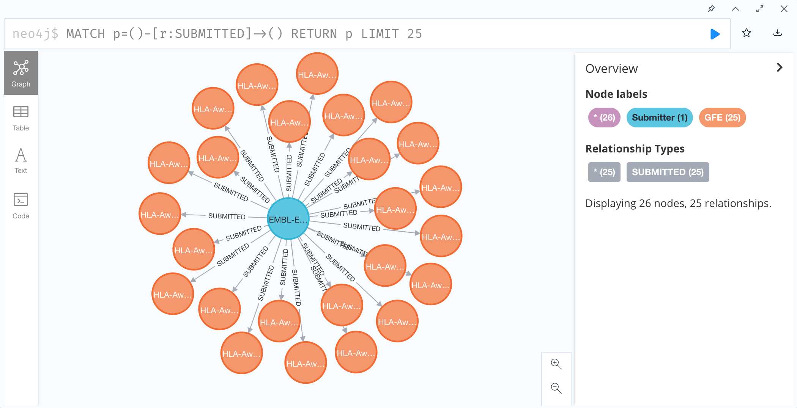
</p>

#### Description
Links the Submitter node to the GFE node. 

#### Properties
```json
{
  "submit_date": "2022-02-17"
}
```
| Property      | Example    | Data Type       | Description        |
|---------------|------------|-----------------|--------------------|
| `submit_date` | 2022-02-17 | datetime string | Date of submission |

## Breaking down a GFE

The representation of a single GFE, for example corresponding to the allele `HLA-A*01:01:01:01` can be understood from the graph.

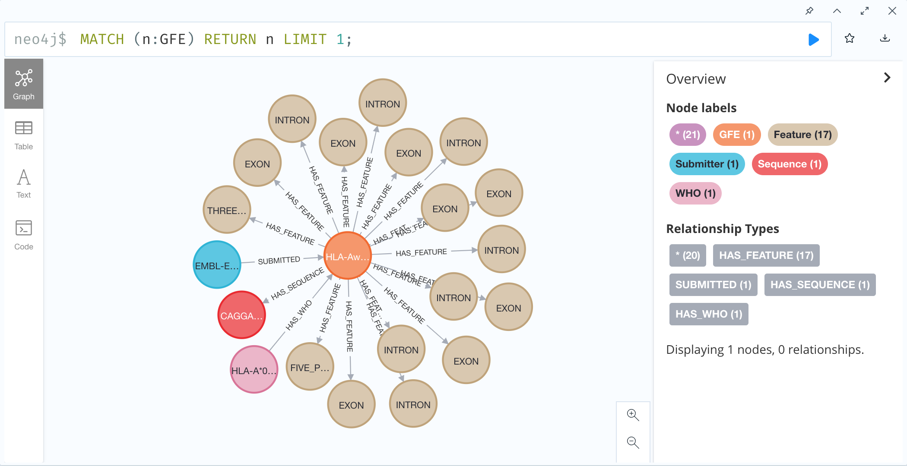

The GFE node points to a WHO node as one of possibly many annotations.
With this schema it is possible to analyze GFEs that do not have an WHO label associated with it.

To see the how a GFE expands to its constituent components, the following query returns the corresponding features associated with the GFE referred to by the WHO allele `HLA-A*01:03:01:01`.
```cypher
MATCH (:WHO {name:'HLA-A*01:03:01:01'})-[]-(:GFE)-[]-(f:Feature) 
RETURN f.term, f.rank ORDER BY f.term, f.rank
```
Results:
| f.term          | f.rank |
|-----------------|--------|
| EXON            | 1      |
| EXON            | 2      |
| EXON            | 3      |
| EXON            | 4      |
| EXON            | 5      |
| EXON            | 6      |
| EXON            | 7      |
| EXON            | 8      |
| FIVE_PRIME_UTR  | 1      |
| INTRON          | 1      |
| INTRON          | 2      |
| INTRON          | 3      |
| INTRON          | 4      |
| INTRON          | 5      |
| INTRON          | 6      |
| INTRON          | 7      |
| THREE_PRIME_UTR | 1      |

These features each have an accession number that is unique in the context of the locus, term and rank combination and is a **permanent reversible 1-to-1 mapping** between the sequence and the accession number in that context.

Mapping is not permanent, reversible or 1-to-1 for these entity properties:
- WHO/IMGT_HLA names and sequences
- WHO/IMGT_HLA names and IMGT accession numbers
- IMGT accession numbers and sequence

Here is a older example of a relationship between a WHO/IMGT_HLA allele (`HLA-DRB1*11:17`) and the corresponding GFE.

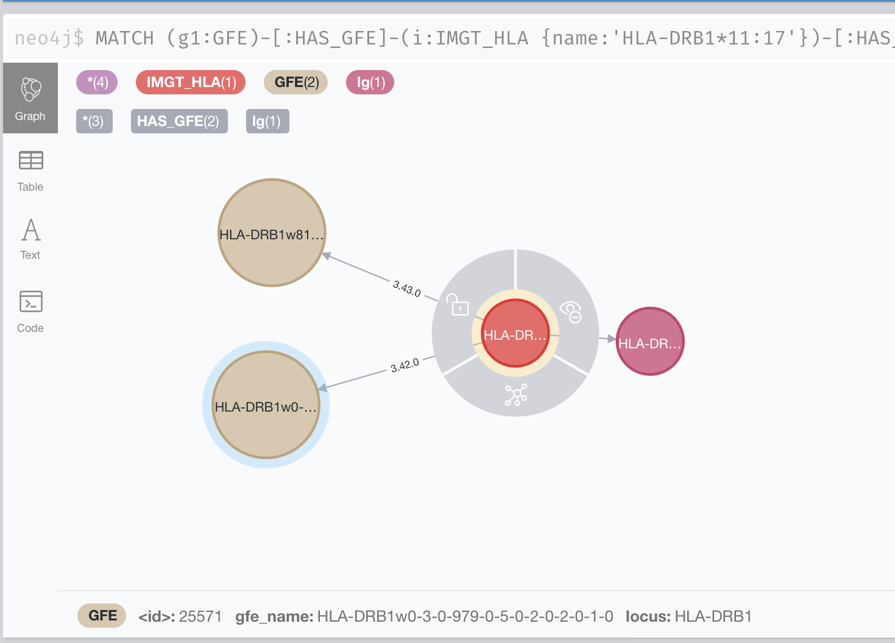

In this example, the GFE associated with this allele changed between 3.42.0 and 3.43.0 

