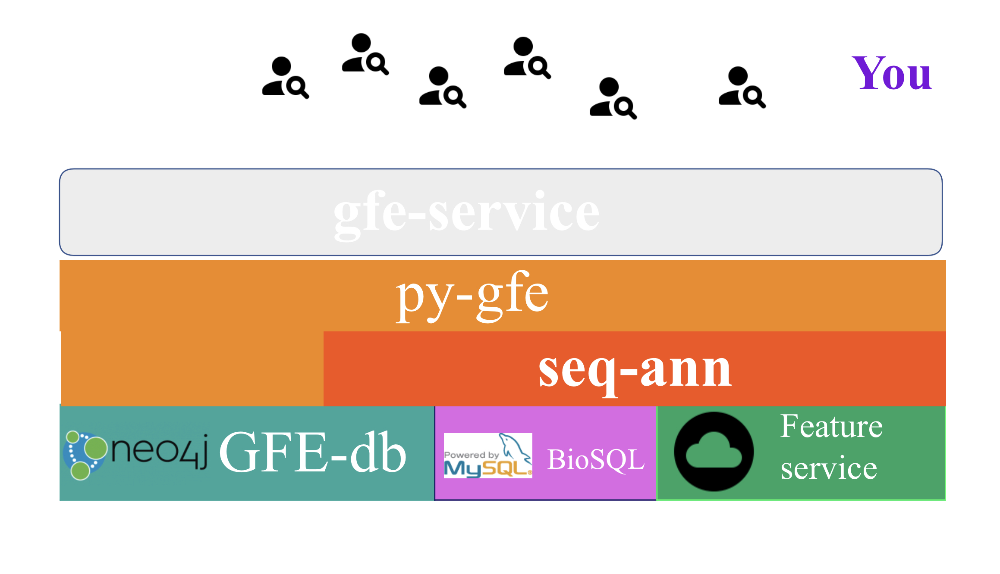
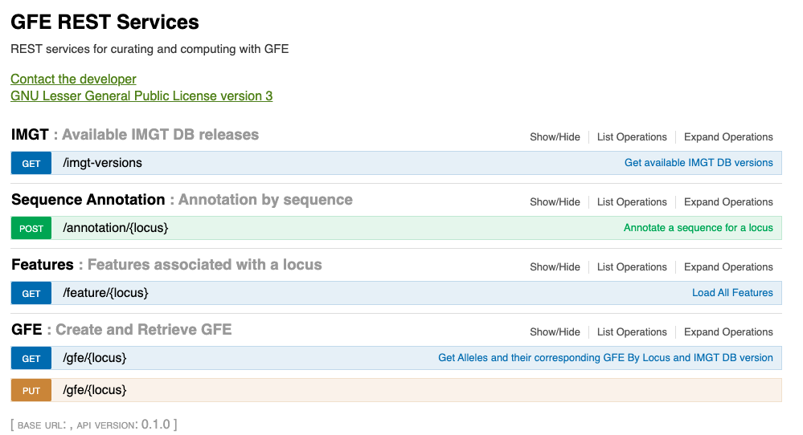

## gfe-service
gfe-service is the public REST interface to the GFE system

The [py-gfe](https://github.com/nmdp-bioinformatics/py-gfe) module performs all of the underlying actions either directly against the [gfe-db](https://github.com/nmdp-bioinformatics/gfe-db) (Neo4j) or via the [seq-ann](https://github.com/nmdp-bioinformatics/seq-ann) module.  The seq-ann module uses feature-service for cloud storage of individual features and BioSQL for sequence analysis.

# REST endpoint

Live at [http://gfe.b12x.org/ui](http://gfe.b12x.org/ui)

## Swagger interface as of 2021-04-01

